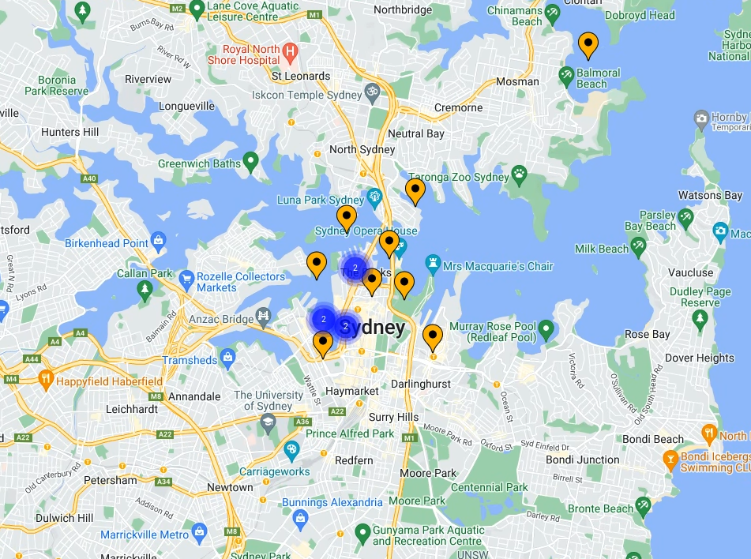

# Google Maps Platform 101: React Codelab

## Description
This repo contains the project template and finished code for the [Google Maps Platform 101: React codelab](https://developers.google.com/codelabs/maps-platform/maps-platform-101-react-js).

## Getting Started
To get started with the codelab, download or fork this repo. A starter template is available in `/starter` and the full solution code is available in `/solution`.

To run the starter or solution apps, run the following from their respective directories:

1. `npm i`
2. `npm start`

This will install the needed dependencies and run the app locally in your browser using Webpack Dev Server.

## Terms of Service

This sample uses Google Maps Platform services, and any use of Google Maps Platform is subject to the [Terms of Service](https://cloud.google.com/maps-platform/terms).

This sample is not a Google Maps Platform Core Service. Therefore, the Google Maps Platform Terms of Service (e.g. Technical Support Services, Service Level Agreements, and Deprecation Policy) do not apply to the code in this sample.

## Support

This sample is offered via an open source license. It is not governed by the Google Maps Platform Support [Technical Support Services Guidelines](https://cloud.google.com/maps-platform/terms/tssg), the [SLA](https://cloud.google.com/maps-platform/terms/sla), or the [Deprecation Policy](https://cloud.google.com/maps-platform/terms) (however, any Google Maps Platform services used by the sample remain subject to the Google Maps Platform Terms of Service).

If you find a bug, or have a feature request, please [file an issue](https://github.com/googlemaps-samples/codelab-maps-platform-101-react-js/issues) on GitHub. If you would like to get answers to technical questions from other Google Maps Platform developers, ask through one of our [developer community channels](https://developers.google.com/maps/developer-community). If you'd like to contribute, please check the [Contributing guide](CONTRIBUTING.md).

You can also discuss this sample on our [Discord server](https://discord.gg/hYsWbmk).

[codelab]: https://developers.google.com/codelabs/maps-platform/maps-platform-101-react-js
[file an issue]: https://github.com/googlemaps-samples/codelab-maps-platform-101-react-js/issues
[pull request]:  https://github.com/googlemaps-samples/codelab-maps-platform-101-react-js/compare
[code of conduct]: CODE_OF_CONDUCT.md